# Patterns of Play

**The tactics board your players actually watch.**

Draw a pattern on a live board that shows you which passes are on and which are
covered, record it the way you would draw it on a whiteboard, and send it to the
squad's phones. You see who watched it.

**Try it: <https://patterns-of-play.onrender.com>** . Sign in as
`coach@example.com` / `demo-pass-2026` (or `player@example.com`, same password).
It is a free instance, so the first request after a quiet spell takes about a
minute to wake up, and the demo team is rebuilt on every restart.

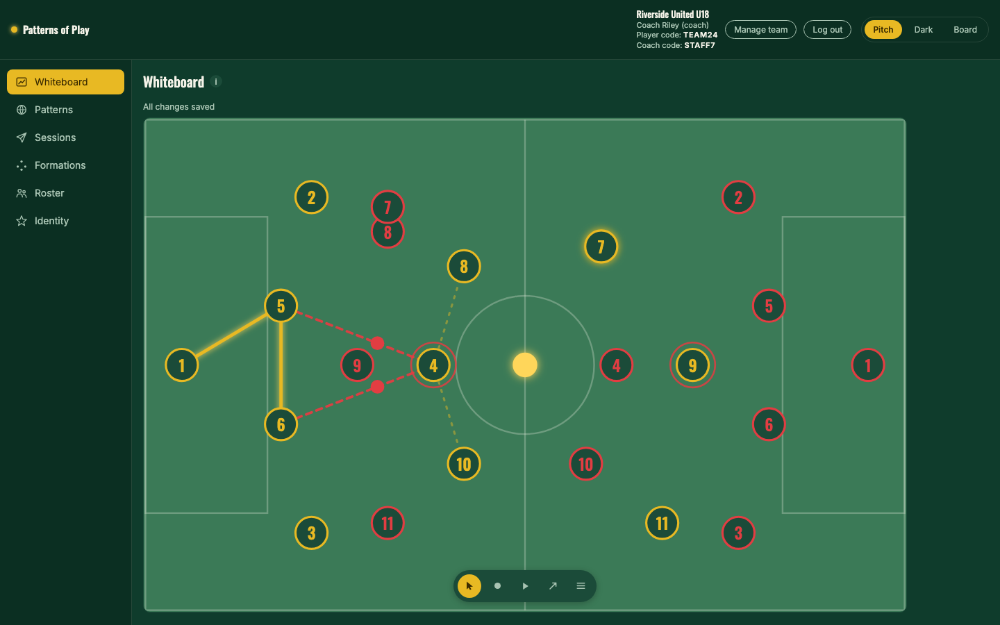

## Why a coach cares

- **The board tells you what the defence has taken away.** Every pass your player
  can make is drawn as you move people. Gold means it is on, red means someone is
  standing in it, and the red dot is exactly where it gets intercepted.
- **Twelve patterns, six shapes, and the rondos that train them, already in it.**
  Overlaps, third-man runs, build-out against a press, pressing triggers. Each one
  plays out on the pitch with the ball, not as a static diagram.
- **Your session lands on their phone, not in a group chat.** Bundle two patterns
  and a note, send it, and see "3 of 5 watched" before you get to training.
- **It tells you when a pairing will cost you.** Put a flying fullback behind a
  winger who does not track back and it says so, on that flank, by name.

## The walkthrough

**1. Move a player, and the passing picture redraws.** Solid gold is a lane the
coach has locked in; dashed red with a dot is a lane an opponent has taken away.


**2. Hit record and coach it the way you would on a whiteboard.** Every player,
every opponent, and the ball are captured, and the ball leaves a gold trace.

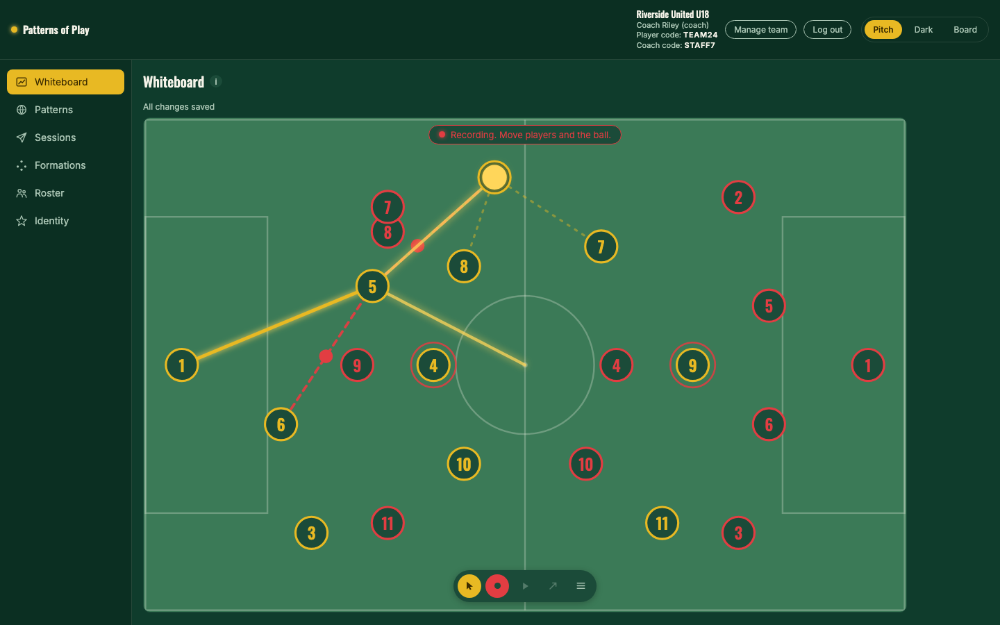

**3. Pull up the library.** Twelve pattern archetypes, eight delivery types, three
whole-team rotations, filtered by what you want to work on.

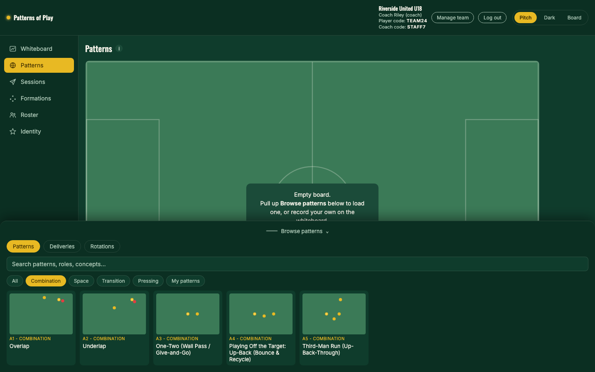

**4. Play one on the board.** The ball chases the runner it was played to, so the
pass connects the way it does on grass.

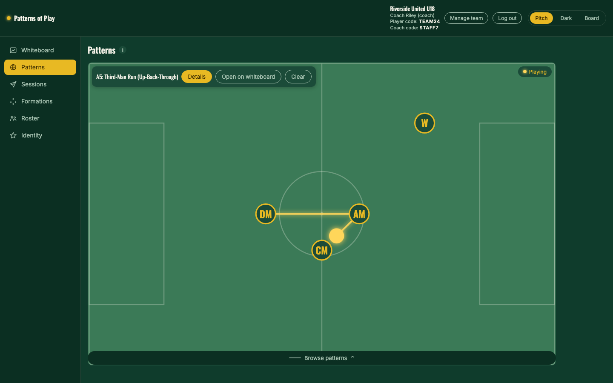

**5. Load a shape and tap the players it hinges on.** The 4-3-3 with its pivot
keystone, and what that role has to be able to do.

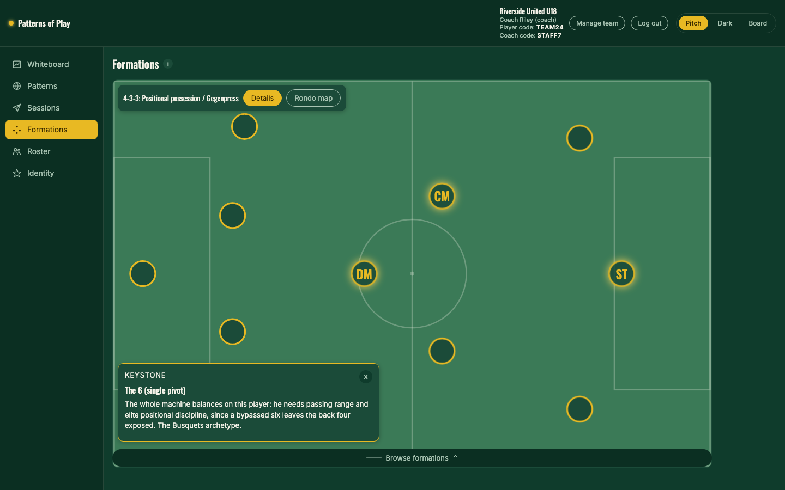

**6. Turn on the rondo map.** Each zone tells you which rondo belongs there and
which pattern it trains.

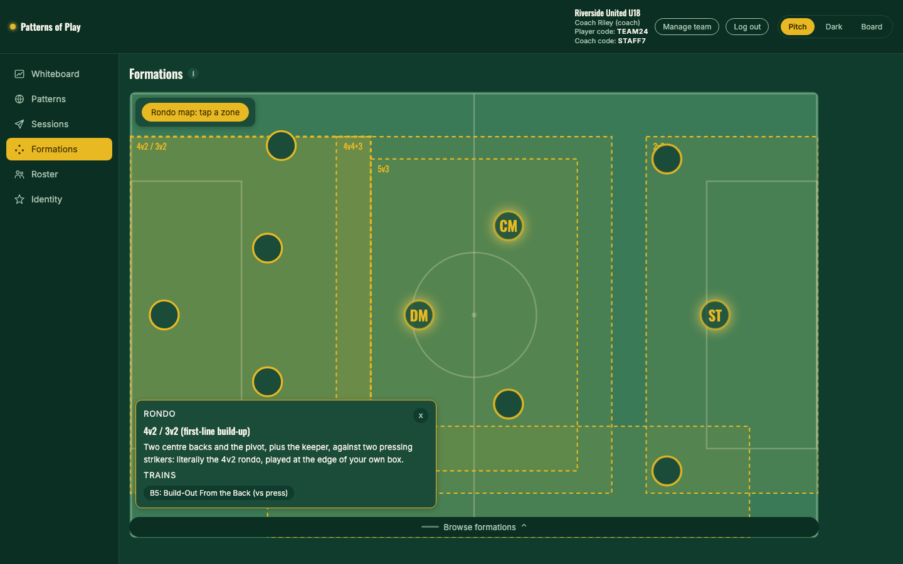

**7. Show them who already plays this way.** A reference team's signature idea
runs on the board, with the five-part card behind it.

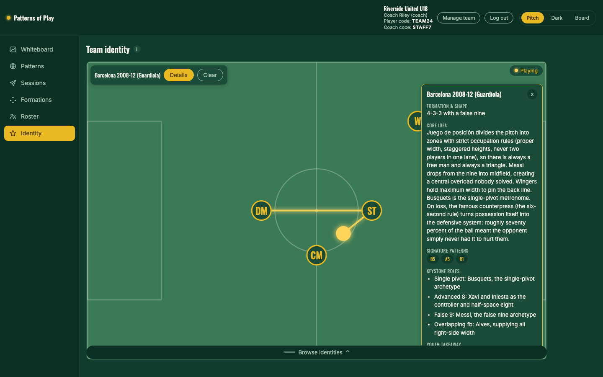

**8. Build the squad, and get told when a flank is exposed.** Roles, work rates,
six coach-rated sliders, and the fit warning that reads the pairing.

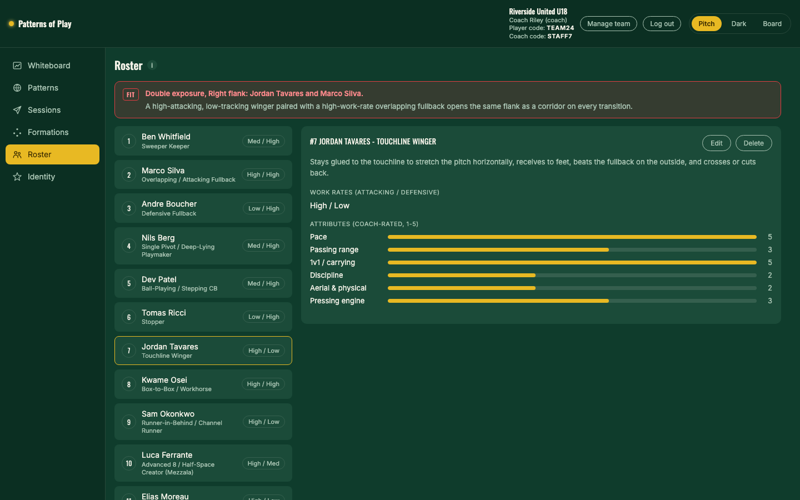

**9. Send the session and watch the receipts come in.** A pattern from the
library, your own recording, a note, and per-player read receipts.

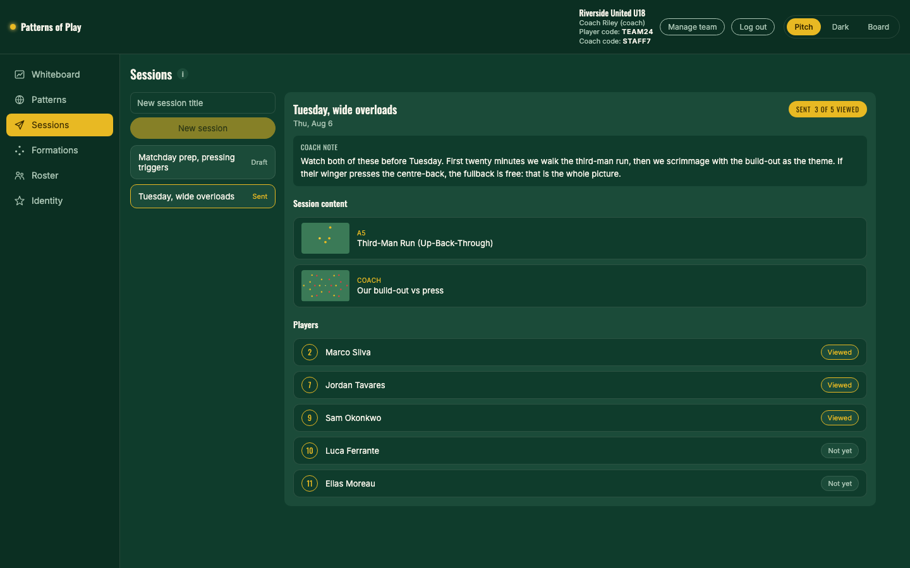

**10. On their phone, the board goes portrait.** Same pattern, same coordinates,
readable in a hand.

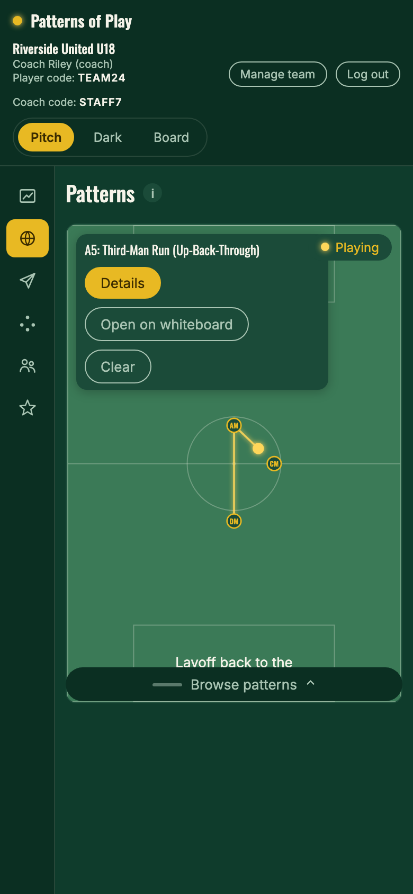 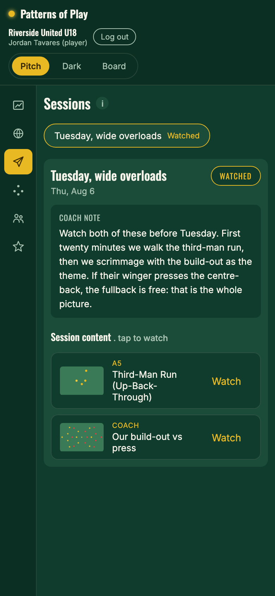

## Quickstart

```bash
make bootstrap   # Python venv + npm install, once
make demo        # rebuild the database and load a full demo team
make dev         # http://127.0.0.1:5173
```

`make demo` drops the dev database, runs the migration chain from zero, loads the
tactical content, then creates one realistic team: 14 players with roles and
sliders, a live whiteboard, a recorded pattern, and two sessions (one sent with
receipts, one draft ready to send in front of the room). Rerun it any time to get
back to a clean starting state.

Sign in at <http://127.0.0.1:5173>:

| | Email | Password |
|---|---|---|
| Coach | `coach@example.com` | `demo-pass-2026` |
| Player | `player@example.com` | `demo-pass-2026` |

Join codes for the demo team are `TEAM24` (joins as a player) and `STAFF7` (joins
as a coach). The code decides the role, not the account.

Other targets: `make verify` (copy scan, permission suite, lint, typecheck, unit
and integration tests, and the Playwright journeys on both viewports),
`make screenshots` (rebuilds the demo database and recaptures `docs/screenshots/`).

## Deployment

`render.yaml` describes a single Docker web service that serves the SPA and the
API from one origin (`Dockerfile`, `scripts/start.sh`). Pushing to `main`
redeploys it.

The live instance runs on Render's free plan, which has **no persistent disk**.
The SQLite file is rebuilt on every boot, which is why `POP_SEED_DEMO=true` is
set: the demo team, its content and its logins come back on every restart, so
the credentials above always work and the demo always opens in the same state.
Anything created while poking around does not outlive the instance, and a free
instance sleeps after about fifteen minutes of quiet.

To make it durable for a real club: raise `plan` to `starter`, attach a disk
mounted at `/data`, and set `POP_SEED_DEMO=false`. `DATABASE_URL` already points
there, so nothing else changes. Litestream replication (doc 04 section 2) is the
step after that, not before it.

## Stack and architecture

React 19 + Vite + TypeScript on the front, FastAPI + SQLAlchemy 2 + Alembic over
SQLite (WAL) on the back. No ORM-free corners, no client state store: the server
is the source of truth and every screen re-reads from it.

- **Board engine** (`frontend/src/board/`). SVG behind a component boundary.
  Pointer input is coalesced to one update per animation frame and written
  straight to the DOM, so a drag never re-renders all 23 tokens. The lane graph,
  marking rings, zone overlays, animation player, and recorder all share one
  coordinate and timing model.
- **Coordinates.** Every position is stored in landscape model coordinates (x 0
  to 100 toward the attacking goal, y 0 to 100 top to bottom). Orientation is a
  render concern only: portrait maps `left = y, top = 100 - x`, with the inverse
  applied to drag input, so a pattern recorded on a laptop replays correctly on a
  phone and the round trip is covered by a test.
- **Two animation formats, one player.** Library presets are declarative specs
  (player from-to plus ball waypoints bound to the player who starts or finishes
  at that spot); recordings are raw keyframes. The player abstracts over both.
- **Tenancy.** Every team-scoped query goes through one scoped query layer
  (`backend/app/scoped.py`) built from the caller's own membership. No route
  handler filters by `team_id`, and no request body can supply one.
- **Permissions are API-enforced, not UI-hidden.** Coach-only data (fit warnings,
  read receipts, join codes) is absent from a player's payload rather than nulled,
  via split response models. `backend/tests/test_permissions.py` asserts every row
  of the permission table, and `make permissions` fails if any row is skipped
  rather than checked.
- **Content is data.** Patterns, deliveries, rotations, formations, keystones, the
  rondo map, and the identity library live in `seeds/*.json` with a validator, so
  the tactical content can be revised without an engineer.
